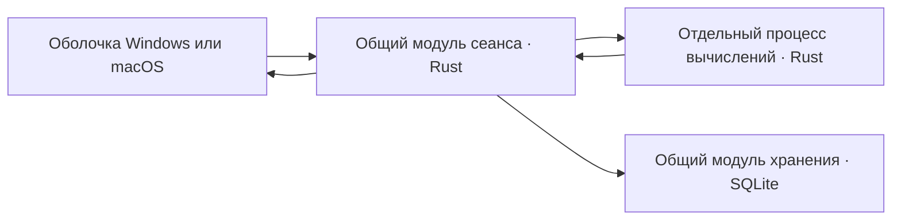

# Проект общего ядра и оболочек

Статус: принятая инженерная основа спецификации для [Общее ядро и платформенные оболочки](../issues/09-shared-core-and-shells.md). Раунд 41 и уточнённый предел расчёта 500 мс раунда 42 приняты. Ограниченные эксперименты чисел, Windows-изоляции, WPF/Rust, двух нативных редакторов и SQLite-хранения на Windows завершены; Mac-исправления подтверждены пользователем. Технологическое направление и ответственность модулей зафиксированы ниже; вопрос архитектуры разрешён. Прохождение бюджетов, реальный IME и полная реализация не заявляются.

## Технологическая основа после экспериментов

Для спецификации выбран общий Rust-код и две нативные оболочки: C#/WPF с AvalonEdit на Windows, Swift/AppKit с NSTextView на macOS. Связь с модулем сеанса — версионированный C ABI; потенциально дорогие вычисления выполняет отдельный Rust-процесс. Общий модуль хранения использует SQLite через rusqlite. Численный модуль содержит собственные точные операции и обязательное округление над IBig; Dashu применяется через проверяемый адаптер для выбранных сложных алгоритмов. Версии, использованные в опытах, служат воспроизводимой основой; обновление зависимостей требует повторной проверки соответствующих интерфейсов.

Причина двух оболочек — проверенные пути системного фокуса, нативного редактирования и оформления. Цена решения — отдельная реализация размещения и системных действий на двух платформах. Чтобы она не создала два разных калькулятора, язык, типы, неоднозначности, подсказки, смысловые диапазоны подсветки, формат результатов, подтверждение и хранение находятся в общем коде. Общий интерфейс окна был альтернативой; переход к нему потребовал бы повторных наблюдений тех же сценариев и не отменил бы системные адаптеры.

| Проверенное основание | Что оно позволяет выбрать | Чего оно не доказывает |
| --- | --- | --- |
| Числа: 192/192 эталона | Собственный точный адаптер вместо прямого библиотечного Context(30) | Весь каталог функций и весь диапазон аргументов |
| WPF/Rust: 16 сценариев; Mac: 9 групп и ручное подтверждение исправлений | Общий сеанс, C ABI и два нативных редактора | Новый Mac-отчёт 13/13, реальный IME и доступность |
| Нативная остановка на обеих ОС | Изоляцию вычисления с подтверждением выхода процесса | Физическое завершение точно в 200 мс |
| Хранение: 24 Windows-сценария | Общий транзакционный модуль, проверяемый backup и восстановление | Power loss, Mac/APFS и полную предметную схему |

Это выбор технической основы для дальнейшей спецификации, а не перенос одноразового parser или макета в готовый продукт. Интерфейсы ниже сохраняют принятые продуктовые правила; [предел ожидания результата](deadline-proposal.md) принят с уточнением до 500 мс на сам расчёт.

## Общая схема

Системное окно и редактирование выполняет оболочка: Windows — C#/WPF, macOS — Swift/AppKit. Общими остаются язык, численные правила, типы, lazy-решатель, контекстные подсказки, подсветка, семантические ссылки, форматирование, готовые строки буфера, состояние подтверждения и правила хранения. Нативные адаптеры обеспечивают окно, глобальное сочетание, фокус, буфер, часы, системные параметры, IME и доступность. Две оболочки не вычисляют формулы своими библиотеками.

Это развивает [проверенный минимальный прототип](../issues/11-platform-prototype.md), а не переносит его фиксированные ответы в продукт. Исследования [изоляции](../research/compute-isolation.md), [хранения](../research/durable-local-storage.md) и [чисел](../research/numerical-core-options.md) обосновывают кандидатов и явно отделяют факты от непроверенных рекомендаций.

## Модули и их интерфейсы

| Модуль | Интерфейс для вызывающей стороны | Что скрывает реализация |
| --- | --- | --- |
| Сеанс | Команда пользователя с ревизией документа → события состояния и запросы системных действий. | Актуальность, переключение режимов, планирование расчёта, зависимые документы, попытка подтверждения, связь со worker и хранилищем. |
| Язык и вычисления | Неизменяемый снимок текста/ссылок/определений/контекста → полные результаты выражений, диагностика и данные представления. | Разбор, альтернативные разборы, типовые операции, зависимости, численные алгоритмы, подсветка, подсказки и форматирование. |
| Хранение | Чтение снимка/страницы; атомарная предметная команда с ожидаемой ревизией и ID операции; предпросмотр переноса; резервный снимок. | SQL, схема, идентичность импорта, транзакции, миграции, backup, пагинация и проверка фактической записи. |
| Системные адаптеры | Запрос действия с ID → результат его выполнения. | Особенности Windows/macOS: clipboard, фокус, глобальные клавиши, запуск/остановка worker, файловая синхронизация и размещение окон. |

Оболочка получает готовые данные показа и значения для копирования, а не воспроизводит предметные условия. Измерения шрифта, строки и каретки остаются у нативного редактора. Числовое форматирование не использует `double`, Swift `Double`, JavaScript `Number` или SQLite REAL вместо рабочего значения.

## Сеанс, ревизии и системные действия

У каждого документа есть стабильный ID и возрастающая ревизия текста. Изменение опубликованных определений, словарей или контекста расчёта образует новую ревизию снимка. Запрос и ответ содержат documentId, revision, definitionsRevision, requestId и workerGeneration. Совпадение одного текста не означает совпадение расчёта: могли измениться определение, язык, формат или часы.

Новая правка сразу делает прежний запрос неактуальным; оставляется последний ожидающий снимок. Опоздавшее сообщение не меняет ответ и не показывает ошибку у нового текста. Целый готовый независимый результат листа может сохраниться по принятому контракту; незавершённая затронутая строка не наследует старый ответ как готовый.

C ABI связывает оболочку с управляющим модулем: непрозрачный handle, версии, UTF-8 с длиной и явное освобождение полученного буфера. Короткий вызов ставит команду в очередь; события забираются отдельно. Одно уведомление о переходе очереди из пустой в непустую будит UI, постоянного опроса в скрытом простое нет. Уведомление только сигнализирует: оно не исполняет код управления окном под блокировкой общего модуля. Исключения/panic не пересекают ABI; его интерфейс не ждёт вычисления или блокирующего pipe на UI-потоке.

[Сквозной Windows-эксперимент](../issues/29-rust-shell-probe.md) подтвердил этот путь для ограниченной арифметики. Binding последовательно обращается к session handle с WPF-потока; выходные UTF-8 буферы выделяются и освобождаются Rust, делегаты удерживаются до успешного destroy. Уже готовое событие может устареть в очереди перед доставкой, поэтому актуальность повторно проверяется общим модулем в drain. Уничтожение после неподтверждённого native stop возвращает неуспех и сохраняет владение для явной повторной попытки; освобождённый handle недоступен обработчикам ранее посланных оконных сообщений. Конкурентное уничтожение и повреждение самой DLL успешным опытом не покрываются.

Действия clipboard/focus адресуются уникальным ID и завершаются явным ответом оболочки. Только фактический успех действия двигает состояние подтверждения. Обычное Ctrl+C с выделением использует видимый выделенный текст; без выделения — ранее согласованный целевой готовый результат. Команда Enter не является синонимом простого копирования.

## Разбор и типизированные значения

Исходный текст сохраняется вместе со стабильными смысловыми ссылками распознанных фрагментов. Ссылка на пользовательское определение относится к ID, а не только к его текущему имени. Неопознанный/незавершённый текст не исправляется догадкой при сохранении, импорте или смене языка. Номер версии языка и формата ссылок хранится отдельно от текста.

Для обычных операторов предлагается разбор с таблицей приоритетов из [пользовательской инструкции](../help/operator-help.json). Локальные неоднозначности дают несколько связанных узлов разбора, а не один заранее выбранный смысл: например, составная длительность и произведение длин. Общие части хранятся совместно. Решатель распространяет ограничения внутри и между вложенными выражениями, затем вычисляет допустимые ветви. Все обращения к одной связанной величине в расчёте разделяют её выбор смысла: `a=1m; a/a` не превращается в независимые метры/минуты.

Типизированная числовая величина содержит опорное число, тип и контекст масштаба. Применимое процентное переопределение имеет преимущество с сохранением исходного порядка операндов; прочие типы сохраняют собственные ограничения. Календарные значения и режим платежа представляются отдельными вариантами значения. Это модель общего вычислителя; «наследование числа» из пользовательского контракта не требует буквальной иерархии классов Rust.

Для каждой готовой видимой записи возвращаются все скрытые значения/смыслы, которые она объединяет. Дедупликация применяется к полному видимому представлению, включая единицу, отдельно от строки буфера. Превышение стоимости потенциально допустимой ветви завершает расчёт диагностикой сложности, а не превращает обрезанный набор в готовый ответ. Совместимость типов и техническое ограничение различаются.

Часы передаются единым снимком на расчёт. Тики видимых динамических выражений создают новые запросы; скрытые листы пересчитываются при открытии. Уже сохранённая история и замороженная попытка подтверждения не пересчитываются от тиков. Смена локали сохраняет неизменными рабочие значения и пользовательские имена/комментарии.

## Числа и ограничение стоимости

Предлагается точный десятичный адаптер над целым коэффициентом и десятичной экспонентой. Он проверяет вход, диапазон, точные целые и обязательное округление после операций по [numbers.json](../language/numbers.json). Кандидат сложных алгоритмов — Dashu 0.6.0 с проверяемым контекстом; библиотечные overflow/underflow/потеря доказанного округления не переводятся молча в готовый ответ. Композиции тригонометрии, логарифмов и финансовых функций требуют контроля общей ошибки, не просто фиксированного запаса цифр.

[Численный эксперимент](../issues/28-decimal-backend-probe.md) поддерживает этот выбор: собственная точная арифметика над IBig и выбранные сложные алгоритмы дали 192/192 совпадения с независимыми эталонами. Прямой Context(30) в 22 числовых случаях сложения, вычитания и деления вернул 31 значащую цифру, поэтому обязательное рабочее округление остаётся обязанностью нашего адаптера. Направленные композиции градусов и выбранных финансовых моделей дали правильные конечные ответы; весь каталог, полные области функций и независимое включение в Dashu-интервалы этим корпусом не подтверждены. Финансовые атомарные функции проверены с конечным округлением, отдельно от цепочек обычных операций.

Рабочие 30 значащих цифр, граница 10^(-1000), показ до десяти дробных знаков с согласованным исключением для малых чисел и строка буфера остаются разными стадиями. На проводе/диске коэффициент передаётся строкой, не binary64. Для тестирования необходимы обе стороны точных половин и перенос разряда, например `999999999999999999999999999998 / 4` → `250000000000000000000000000000`; отдельно — integer overflow и сохранение малого ненулевого значения.

Один последовательный worker выполняет потенциально дорогой разбор, зависимости, lazy-решатель и численные алгоритмы. Он получает снимки, не открывает пользовательскую базу, не создаёт потомков и не обращается к сети. Детерминированные проверки стоимости дополняют общий elapsed-guard. Контроллер проверяет срок при приёме результата независимо от срабатывания таймера; перезапуск не обнуляет срок того же запроса.

Срок одного запроса — 500 мс от актуальной завершённой правки, включая передачу снимка и всю затронутую работу; промежуточная IME-композиция запрос не запускает. Native adapter передаёт начальную монотонную отметку/остаток бюджета без потери расходов до Rust submit. Граница C ABI фиксирует единицы и преобразование часов; разные clock domains нельзя вычитать напрямую. При elapsed ≥ 500 мс запрос просрочен независимо от готовности таймера. Актуальность и срок повторно проверяются перед применением готового события в UI. Полный допустимый ответ показывается немедленно; ожидания до 500 мс не добавляется.

Превышение логически отменяет запрос и инициирует остановку worker. Незавершённые затронутые выражения получают диагностику сложности в ближайший проход UI без намеренной задержки; синхронного ожидания native stop на UI нет. Независимые готовые результаты сохраняются. После отмены позднее событие не меняет состояние; новая правка создаёт новый requestId и свой срок. Отдельного численного срока показа ошибки нет. Обычный ответ по-прежнему проверяется на 50 мс, обычный пересчёт большого листа — на 200 мс в 95% замеров.

Команды и ответы — ограниченные кадры «длина + UTF-8 JSON» по локальным pipe. Чтение, запись и watchdog независимы; большие снимки передаются несколькими проверяемыми кадрами без усечения. Неполный кадр или неверная версия не означают частичный успешный результат. Управляющий модуль не держит общую блокировку на время I/O.

Windows использует Job Object с назначением при создании процесса и KILL_ON_JOB_CLOSE; macOS — kill плюс wait/reap и независимое наблюдение EOF родителя. Срок допуска ответа, запрос остановки и фактический выход процесса измеряются отдельно. Предел 500 мс не является гарантией физического завершения/отрисовки точно на этой миллисекунде; сохранённые [бюджеты](../distribution/performance.json) проверяются измерениями. Неограниченную цепь замен worker создавать нельзя; принятое поведение после внутренней аварии записано в пункте 41.1 архитектурного вопроса.

[Отдельный Windows-стенд](../issues/27-windows-worker-boundary.md) подтвердил нативный механизм в 11 сценариях, включая непрочитанные stdout/stdin и смерть владельца Job. Фактический выход при прежнем пороге 200 мс наблюдался на 208,4330–216,5342 мс. Это обосновывает изоляцию, но не снимает проверку полного бюджета. Отрицательная проверка срока в функции допуска не подменяет измерение того, когда общий контроллер и UI действительно обработали событие. Исторические результаты не пересчитываются после принятия новых 500 мс.

Последующий [WPF/Rust-стенд](../issues/29-rust-shell-probe.md) прошёл 16 сценариев и измерил уже реальное применение состояния к UI. На шести обычных формулах наблюдалось 0,2143–5,6770 мс от TextChanged до применения ответа после готовности worker. Timeout при прежнем пороге 200 мс применялся на 207,9857–214,9435 мс, выход процесса — на 209,8574–216,7980 мс. Это не p95 продукта, не физическая отрисовка и не приёмка новых 500 мс. Неуспешная остановка явно удерживает worker и запрещает запуск замены; успешный stop означает wait, а не попытку kill. Окончание IO-потоков учитывается отдельно от EOF/ошибки чтения.

## Редактор и локализация

Нативный редактор владеет кареткой, выделением, составным вводом и текстовым Undo. Общий модуль возвращает диапазоны подсветки, смысловые ссылки и варианты вставки. На границе интерфейса используются диапазоны UTF-16, соответствующие двум нативным редакторам; общий модуль проверяет границы суррогатных пар и преобразует их в своё представление UTF-8. Движение по графемам определяется редактором, не арифметикой байтов.

Автоматическое надстрочное оформление `m2`/`m3` выполняется проекцией распознанных диапазонов над исходным текстом, без отдельного шага Undo. При продолжении слова проекция снимается. Выделенное копирование/вырезание формирует принятую видимую запись с ²/³; вставленный текст проходит обычный разбор. Изменение текста через подсказку входит в одну обычную операцию Undo. Нельзя заново присваивать весь текст редактора при каждом ответе вычислителя.

[Ограниченный Windows-эксперимент](../issues/30-native-editor-probe.md) проверил кандидата WPF/AvalonEdit 6.3.1.120: TextDocument хранит исходник, VisualLineElementGenerator отображает степень с исходной длиной 1, DocumentColorizingTransformer меняет только визуальные свойства. 23 сценария подтвердили редактирование, Undo/Redo, выделение, вставку, сохранение скобок и обратную геометрию на четырёх масштабах. Это механизм Undo AvalonEdit, не стандартного TextBox. Общий семантический модуль ещё должен выдавать проверенные диапазоны вместо лексического заменителя стенда. Проекция не является редактором всего продукта сама по себе.

Для clipboard нужен явный маршрут до встроенных команд редактора, включая CanExecute: поздно добавленный binding не гарантирует перехвата. Диспетчер выбирает видимое выделение либо согласованный результат без выделения; нативный адаптер сообщает фактический успех. Вырезание удаляет текст только после успешной записи. У AvalonEdit собственный IMM32-путь; реальный составной ввод, его отмена/подтверждение, доступность и AppKit требуют самостоятельных наблюдений. Искусственный start/end проверяет только защиту от вмешательства приложения, не системный IME.

Подсказки формируются общим семантическим фильтром до ранжирования; видимый список не выбирает смысл неоднозначной единицы за пользователя. Геометрия использует принятый [контракт размещения](../interface/settings.json), включая A у края. Английские метаданные надписей и соседние en/ru остаются независимыми от текста формул. Диагностика передаётся как стабильный ключ, аргументы и диапазон; системная оболочка не переводит произвольный текст ошибки backend.

## Хранение, снимки и подтверждение

Кандидат — единая локальная SQLite-база и общий Rust-модуль хранения: `rusqlite 0.40.2`, bundled SQLite 3.53.2 с зафиксированными версиями. Единственный владелец записи находится на отдельном потоке процесса оболочки, вне worker. Исходная конфигурация WAL/FULL, foreign_keys и macOS fullfsync подтверждается чтением фактических параметров. Версия ОС SQLite не подменяет выбранную встроенную версию.

Текст документов, публикации определений, их черновики, настройки, смысловые ссылки, ревизии и снимки истории сохраняются раздельно внутри одной базы. Предметные изменения применяются одной транзакцией с проверкой ожидаемой ревизии; вычисления и диалоги не удерживают пишущую транзакцию открытой. Исторические значения не зависят внешним ключом от существования действующего определения. Страницы истории загружаются по мере просмотра, поиск охватывает весь сохранённый объём; пагинация не удаляет данные.

Подтверждение быстрого расчёта: создать confirmationId в текущем сеансе → записать полный исторический снимок одной транзакцией → запросить копирование конкретного copyText → после подтверждения успеха очистить ввод/свернуть историю и при необходимости скрыть окно. Повтор использует тот же ID для того же незавершённого подтверждения и не добавляет вторую запись. Новое намеренное подтверждение получает новый ID. Сбой worker не уничтожает снимок и попытку, которыми владеет модуль сеанса.

После полного перезапуска прежняя история остаётся, а ввод пересчитывается заново по уже принятому правилу. Программа не продолжает старое копирование и не восстанавливает замороженный `now` автоматически. Новый расчёт в новом сеансе может создать новую запись одинаковой формулы; это не повтор прежней незавершённой операции.

Сохранение и пользовательское редактирование идут независимо: некорректный текст листа сохраняем; неудачная запись сохраняет текст в памяти и показывает принятый статус/повтор. После аварии гарантируется только последнее действительно сохранённое состояние. Чтение/проверка хранилища после I/O-ошибки не объявляет файл исправным без проверки.

## Перенос, резервирование и версии

Полный локальный backup — согласованный SQLite-снимок через Backup API, включая историю. Временный файл проверяется и публикуется только после успешного завершения/синхронизации; последняя исправная копия не удаляется заранее. Частота и десять хранимых копий остаются по [принятой политике](../issues/07-templates-and-data.md#answer).

Перенос — отдельный UTF-8 JSON: formatVersion, происхождение и стабильные ID объектов, версия/отпечаток содержимого, текст, смысловые ссылки, зависимости и общие настройки. Истории и параметров устройства в нём нет. Импорт строит полный предпросмотр и таблицу переназначения ссылок, затем применяет единую транзакцию; повтор неизменённого пакета опознаётся по происхождению и содержимому. Формат обмена не является внешним доступом к внутренним SQL-таблицам.

Перед миграцией — защитный согласованный снимок. Таблицы, данные и номер схемы меняются одной транзакцией. Восстановление выбранной копии предварительно проверяет/мигрирует отдельную рабочую копию и выполняет принятую защиту текущего состояния. По принятому 41.2 при разрушенной основной базе сохраняется исходный комплект файлов, а пользователю показываются доступные копии, даты и состав без недостоверного diff. Повреждение нужно отличать от блокировки, нехватки прав и временной I/O-ошибки; такие ошибки не запускают замену базы. По 41.3 неизвестная новая схема не открывается старой программой для записи; неудачная миграция сохраняет исходное состояние и путь возврата к совместимой программе.

## Раунд 41: принятое поведение

### Уточнения по завершённому SQLite-стенду

[Windows/SQLite-стенд](../issues/31-storage-failure-probe.md) подтвердил механизмы в 24 сценариях. Проверка совместимости учитывает подтверждённый WAL: header или immutable могут показать старую версию. Для неизменности исходных файлов сначала получить единоличное владение и скопировать quiescent семью db/WAL/SHM/journal; открыть для проверки копию. Обычный read-only не гарантирует неизменность SHM. В стенде все владельцы известны и завершены; приложение должно обеспечивать это само.

Восстановление готовится в отдельной папке поколения, без подмены db рядом со старым WAL. Защита оригинала, проверка и миграция новой копии предшествуют переключению указателя. На Windows проверен один синхронизированный pointer-файл и MoveFileExW с WRITE_THROUGH/REPLACE_EXISTING на том же томе; неверный указатель не разрешает угадывать поколение. Это не многофайловая транзакция и не доказательство сохранности при отключении питания. Предыдущее поколение не удаляется в той же операции. Для длинного пути нужны `win32-longpath` и расширенная абсолютная Windows-форма; вариант без неё не прошёл целевой контроль.

Публикация backup требует Done, успешного закрытия, повторных integrity/foreign-key/предметных проверок, sync записываемого handle и успешного переименования. Rusqlite Drop скрывает код backup_finish; одну успешную попытку шага нельзя считать завершением. Очистка старых резервов следует за публикацией нового. Неудачные копии и непрозрачная защита повреждённого оригинала не входят в десять исправных резервов. Возможные 11 копий после аварии до очистки требуют безопасного обслуживания, которое ещё не проверялось.

### Продуктовые решения

1. **Внутренняя авария вычисления — принято.** Источник решения: [пункт 41.1](../issues/09-shared-core-and-shells.md#принятое-поведение-при-внутреннем-сбое--пункт-411). Сеанс сохраняет редактор и доступные данные, восстанавливает вычислительную часть без автоматического повтора упавшего расчёта; новая правка создаёт новую попытку. Если запуск worker тоже не удаётся, редактирование и доступные исторические результаты остаются, готовый ответ не подделывается. Таймаут сохраняет отдельную принятую диагностику сложности.
2. **Повреждение основной базы — принято.** Открыть восстановление с доступными копиями, датами и составом; сохранить исходные файлы отдельно. Если текущее состояние не читается, не изображать точное сравнение с ним. Новая пустая база создаётся только явным действием; незаметного отката или сброса нет. При невозможности защитить исходники замена не выполняется. Это дополнение для повреждённого источника, не отмена существующих правил резервного восстановления.
3. **Несовместимый формат/неудачная миграция — принято.** Исходные данные сохраняются, неуспешное обновление структуры не завершается новой схемой. Показывается способ вернуться к совместимой версии программы; старая программа при более новой схеме предлагает обновиться и не переписывает её. Автоматического разрушительного понижения формата нет. Детали установки/отката программы относятся к вопросу поставки после архитектуры.

В английский каталог метаданных и en/ru внесены диагностика вычисления, надписи восстановления/совместимости и соответствующая справка. Источник решений о данных — [пункты 41.2–41.3](../issues/09-shared-core-and-shells.md#принятое-восстановление-данных-и-совместимость--пункты-412413). Принятие поведения не означает готовности реализации или утверждения всех инженерных предложений этого документа.

## Критерии реализации

Ограниченные Windows-эксперименты и [Mac-эксперимент](../issues/32-mac-core-and-editor-probe.md) завершены. Последнее продуктовое решение архитектуры — предел самого расчёта 500 мс — принято. Полный язык, lazy, каталог функций, реальный IME, доступность, Mac-хранилище и нагрузочная матрица остаются критериями реализации; небольшой parser и лексический заменитель не объявляются всем вычислителем.

Rust/Cargo 1.98.1 и rust-mingw подготовлены локально без глобальной установки. Rust/Dashu собран; для C-зависимости SQLite отдельно подготовлен Zig 0.15.2 и проверен wrapper target triple. Базовая Mac-сборка подтверждена логом, следующие исправления редактора — пользователем. Предупреждение Mac rust-objcopy о libLLVM требует устранения при подготовке воспроизводимой поставки. Временной интерфейс и performance.json обновлены до согласованных 500 мс; проверка новой границы относится к реализации. Следующий вопрос карты завершает установку, обновления и приёмку.
