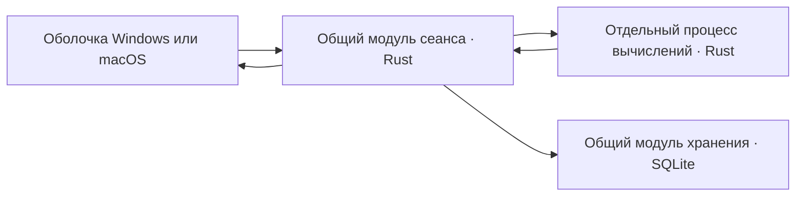

# Проект общего ядра и оболочек

Статус: инженерный проект для [Общее ядро и платформенные оболочки](../issues/09-shared-core-and-shells.md). Поведение при внутреннем сбое вычислений принято в пункте 41.1; вопросы 41.2–41.3 о восстановлении и версии данных ожидают ответа. Численный адаптер, транспорт и остановка worker требуют одноразового эксперимента; окончательный стек и прохождение бюджетов этим документом не объявляются. Принятые язык, интерфейс, история и правила данных остаются источниками требований.

## Общая схема

Системное окно и редактирование выполняет оболочка: Windows — кандидат C#/WPF, macOS — Swift/AppKit. Общими остаются язык, численные правила, типы, lazy-решатель, контекстные подсказки, подсветка, семантические ссылки, форматирование, готовые строки буфера, состояние подтверждения и правила хранения. Нативные адаптеры обеспечивают окно, глобальное сочетание, фокус, буфер, часы, системные параметры, IME и доступность. Две оболочки не вычисляют формулы своими библиотеками.

Это развивает [проверенный минимальный прототип](../issues/11-platform-prototype.md), а не переносит его фиксированные ответы в продукт. Исследования [изоляции](../research/compute-isolation.md), [хранения](../research/durable-local-storage.md) и [чисел](../research/numerical-core-options.md) обосновывают кандидатов и явно отделяют факты от непроверенных рекомендаций.

## Модули и их интерфейсы

| Модуль | Интерфейс для вызывающей стороны | Что скрывает реализация |
| --- | --- | --- |
| Сеанс | Команда пользователя с ревизией документа → события состояния и запросы системных действий. | Актуальность, переключение режимов, планирование расчёта, зависимые документы, попытка подтверждения, связь со worker и хранилищем. |
| Язык и вычисления | Неизменяемый снимок текста/ссылок/определений/контекста → полные результаты выражений, диагностика и данные представления. | Разбор, альтернативные разборы, типовые операции, зависимости, численные алгоритмы, подсветка, подсказки и форматирование. |
| Хранение | Чтение снимка/страницы; атомарная предметная команда с ожидаемой ревизией и ID операции; предпросмотр переноса; резервный снимок. | SQL, схема, идентичность импорта, транзакции, миграции, backup, пагинация и проверка фактической записи. |
| Системные адаптеры | Запрос действия с ID → результат его выполнения. | Особенности Windows/macOS: clipboard, фокус, глобальные клавиши, запуск/остановка worker, файловая синхронизация и размещение окон. |

Оболочка получает готовые данные показа и значения для копирования, а не воспроизводит предметные условия. Измерения шрифта, строки и каретки остаются у нативного редактора. Числовое форматирование не использует `double`, Swift `Double`, JavaScript `Number` или SQLite REAL вместо рабочего значения.

## Сеанс, ревизии и системные действия

У каждого документа есть стабильный ID и возрастающая ревизия текста. Изменение опубликованных определений, словарей или контекста расчёта образует новую ревизию снимка. Запрос и ответ содержат documentId, revision, definitionsRevision, requestId и workerGeneration. Совпадение одного текста не означает совпадение расчёта: могли измениться определение, язык, формат или часы.

Новая правка сразу делает прежний запрос неактуальным; оставляется последний ожидающий снимок. Опоздавшее сообщение не меняет ответ и не показывает ошибку у нового текста. Целый готовый независимый результат листа может сохраниться по принятому контракту; незавершённая затронутая строка не наследует старый ответ как готовый.

C ABI связывает оболочку с управляющим модулем: непрозрачный handle, версии, UTF-8 с длиной и явное освобождение полученного буфера. Короткий вызов ставит команду в очередь; события забираются отдельно. Одно уведомление о переходе очереди из пустой в непустую будит UI, постоянного опроса в скрытом простое нет. Уведомление только сигнализирует: оно не исполняет код управления окном под блокировкой общего модуля. Исключения/panic не пересекают ABI; его интерфейс не ждёт вычисления или блокирующего pipe на UI-потоке.

Действия clipboard/focus адресуются уникальным ID и завершаются явным ответом оболочки. Только фактический успех действия двигает состояние подтверждения. Обычное Ctrl+C с выделением использует видимый выделенный текст; без выделения — ранее согласованный целевой готовый результат. Команда Enter не является синонимом простого копирования.

## Разбор и типизированные значения

Исходный текст сохраняется вместе со стабильными смысловыми ссылками распознанных фрагментов. Ссылка на пользовательское определение относится к ID, а не только к его текущему имени. Неопознанный/незавершённый текст не исправляется догадкой при сохранении, импорте или смене языка. Номер версии языка и формата ссылок хранится отдельно от текста.

Для обычных операторов предлагается разбор с таблицей приоритетов из [пользовательской инструкции](../help/operator-help.json). Локальные неоднозначности дают несколько связанных узлов разбора, а не один заранее выбранный смысл: например, составная длительность и произведение длин. Общие части хранятся совместно. Решатель распространяет ограничения внутри и между вложенными выражениями, затем вычисляет допустимые ветви. Все обращения к одной связанной величине в расчёте разделяют её выбор смысла: `a=1m; a/a` не превращается в независимые метры/минуты.

Типизированная числовая величина содержит опорное число, тип и контекст масштаба. Применимое процентное переопределение имеет преимущество с сохранением исходного порядка операндов; прочие типы сохраняют собственные ограничения. Календарные значения и режим платежа представляются отдельными вариантами значения. Это модель общего вычислителя; «наследование числа» из пользовательского контракта не требует буквальной иерархии классов Rust.

Для каждой готовой видимой записи возвращаются все скрытые значения/смыслы, которые она объединяет. Дедупликация применяется к полному видимому представлению, включая единицу, отдельно от строки буфера. Превышение стоимости потенциально допустимой ветви завершает расчёт диагностикой сложности, а не превращает обрезанный набор в готовый ответ. Совместимость типов и техническое ограничение различаются.

Часы передаются единым снимком на расчёт. Тики видимых динамических выражений создают новые запросы; скрытые листы пересчитываются при открытии. Уже сохранённая история и замороженная попытка подтверждения не пересчитываются от тиков. Смена локали сохраняет неизменными рабочие значения и пользовательские имена/комментарии.

## Числа и ограничение стоимости

Предлагается точный десятичный адаптер над целым коэффициентом и десятичной экспонентой. Он проверяет вход, диапазон, точные целые и обязательное округление после операций по [numbers.json](../language/numbers.json). Кандидат сложных алгоритмов — Dashu 0.6.0 с проверяемым контекстом; библиотечные overflow/underflow/потеря доказанного округления не переводятся молча в готовый ответ. Композиции тригонометрии, логарифмов и финансовых функций требуют контроля общей ошибки, не просто фиксированного запаса цифр.

Рабочие 30 значащих цифр, граница 10^(-1000), показ до десяти дробных знаков с согласованным исключением для малых чисел и строка буфера остаются разными стадиями. На проводе/диске коэффициент передаётся строкой, не binary64. Для тестирования необходимы обе стороны точных половин и перенос разряда, например `999999999999999999999999999998 / 4` → `250000000000000000000000000000`; отдельно — integer overflow и сохранение малого ненулевого значения.

Один последовательный worker выполняет потенциально дорогой разбор, зависимости, lazy-решатель и численные алгоритмы. Он получает снимки, не открывает пользовательскую базу, не создаёт потомков и не обращается к сети. Детерминированные проверки стоимости дополняют общий elapsed-guard. Контроллер проверяет срок при приёме результата независимо от срабатывания таймера; перезапуск не обнуляет срок того же запроса.

Команды и ответы — ограниченные кадры «длина + UTF-8 JSON» по локальным pipe. Чтение, запись и watchdog независимы; большие снимки передаются несколькими проверяемыми кадрами без усечения. Неполный кадр или неверная версия не означают частичный успешный результат. Управляющий модуль не держит общую блокировку на время I/O.

Windows-кандидат использует Job Object с назначением при создании процесса и KILL_ON_JOB_CLOSE; macOS — kill плюс wait/reap и независимое наблюдение EOF родителя. Срок допуска ответа, запрос остановки и фактический выход процесса измеряются отдельно. Обычная ОС не даёт гарантии физического завершения/отрисовки точно на 200-й миллисекунде; сохранённые [бюджеты](../distribution/performance.json) проверяются измерениями. Неограниченную цепь замен worker создавать нельзя; принятое поведение после внутренней аварии записано в пункте 41.1 архитектурного вопроса.

## Редактор и локализация

Нативный редактор владеет кареткой, выделением, составным вводом и текстовым Undo. Общий модуль возвращает диапазоны подсветки, смысловые ссылки и варианты вставки. На границе интерфейса используются диапазоны UTF-16, соответствующие двум нативным редакторам; общий модуль проверяет границы суррогатных пар и преобразует их в своё представление UTF-8. Движение по графемам определяется редактором, не арифметикой байтов.

Автоматическое надстрочное оформление `m2`/`m3` предлагается реализовать как проекцию распознанных диапазонов над исходным текстом, без отдельного шага Undo. При продолжении слова проекция может сниматься. Выделенное копирование/вырезание формирует принятую видимую запись с ²/³; вставленный текст проходит обычный разбор. Изменение текста через подсказку входит в одну обычную операцию Undo. Нельзя заново присваивать весь TextBox.Text при каждом ответе вычислителя. Совместимость этой схемы с IME, курсором и Undo требует отдельной проверки редактора.

Подсказки формируются общим семантическим фильтром до ранжирования; видимый список не выбирает смысл неоднозначной единицы за пользователя. Геометрия использует принятый [контракт размещения](../interface/settings.json), включая A у края. Английские метаданные надписей и соседние en/ru остаются независимыми от текста формул. Диагностика передаётся как стабильный ключ, аргументы и диапазон; системная оболочка не переводит произвольный текст ошибки backend.

## Хранение, снимки и подтверждение

Кандидат — единая локальная SQLite-база и общий Rust-модуль хранения: `rusqlite 0.40.2`, bundled SQLite 3.53.2 с зафиксированными версиями. Единственный владелец записи находится на отдельном потоке процесса оболочки, вне worker. Исходная конфигурация WAL/FULL, foreign_keys и macOS fullfsync подтверждается чтением фактических параметров. Версия ОС SQLite не подменяет выбранную встроенную версию.

Текст документов, публикации определений, их черновики, настройки, смысловые ссылки, ревизии и снимки истории сохраняются раздельно внутри одной базы. Предметные изменения применяются одной транзакцией с проверкой ожидаемой ревизии; вычисления и диалоги не удерживают пишущую транзакцию открытой. Исторические значения не зависят внешним ключом от существования действующего определения. Страницы истории загружаются по мере просмотра, поиск охватывает весь сохранённый объём; пагинация не удаляет данные.

Подтверждение быстрого расчёта: создать confirmationId в текущем сеансе → записать полный исторический снимок одной транзакцией → запросить копирование конкретного copyText → после подтверждения успеха очистить ввод/свернуть историю и при необходимости скрыть окно. Повтор использует тот же ID для того же незавершённого подтверждения и не добавляет вторую запись. Новое намеренное подтверждение получает новый ID. Сбой worker не уничтожает снимок и попытку, которыми владеет модуль сеанса.

После полного перезапуска прежняя история остаётся, а ввод пересчитывается заново по уже принятому правилу. Программа не продолжает старое копирование и не восстанавливает замороженный `now` автоматически. Новый расчёт в новом сеансе может создать новую запись одинаковой формулы; это не повтор прежней незавершённой операции.

Сохранение и пользовательское редактирование идут независимо: некорректный текст листа сохраняем; неудачная запись сохраняет текст в памяти и показывает принятый статус/повтор. После аварии гарантируется только последнее действительно сохранённое состояние. Чтение/проверка хранилища после I/O-ошибки не объявляет файл исправным без проверки.

## Перенос, резервирование и версии

Полный локальный backup — согласованный SQLite-снимок через Backup API, включая историю. Временный файл проверяется и публикуется только после успешного завершения/синхронизации; последняя исправная копия не удаляется заранее. Частота и десять хранимых копий остаются по [принятой политике](../issues/07-templates-and-data.md#answer).

Перенос — отдельный UTF-8 JSON: formatVersion, происхождение и стабильные ID объектов, версия/отпечаток содержимого, текст, смысловые ссылки, зависимости и общие настройки. Истории и параметров устройства в нём нет. Импорт строит полный предпросмотр и таблицу переназначения ссылок, затем применяет единую транзакцию; повтор неизменённого пакета опознаётся по происхождению и содержимому. Формат обмена не является внешним доступом к внутренним SQL-таблицам.

Перед миграцией — защитный согласованный снимок. Таблицы, данные и номер схемы меняются одной транзакцией. Восстановление выбранной копии предварительно проверяет/мигрирует отдельную рабочую копию и выполняет принятую защиту текущего состояния. При разрушенной основной базе достоверный diff с ней может быть невозможен; специальный сценарий восстановления вынесен в раунд 41. Поведение старой программы при новой схеме также требует ответа этого раунда.

## Раунд 41: принятое и ожидающее ответа

1. **Внутренняя авария вычисления — принято.** Источник решения: [пункт 41.1](../issues/09-shared-core-and-shells.md#принятое-поведение-при-внутреннем-сбое--пункт-411). Сеанс сохраняет редактор и доступные данные, восстанавливает вычислительную часть без автоматического повтора упавшего расчёта; новая правка создаёт новую попытку. Если запуск worker тоже не удаётся, редактирование и доступные исторические результаты остаются, готовый ответ не подделывается. Таймаут сохраняет отдельную принятую диагностику сложности.
2. **Повреждение основной базы — предложение.** Открыть восстановление с доступными копиями и их составом; сохранить исходные файлы отдельно. Если текущее состояние не читается, не изображать точное сравнение с ним. Новая пустая база создаётся только явным действием; незаметного отката или сброса нет. При невозможности защитить исходники замена не выполняется. Это дополнение для повреждённого источника, не отмена существующих правил резервного восстановления.
3. **Несовместимый формат/неудачная миграция — предложение.** Исходные данные сохраняются, неуспешное обновление структуры не завершается новой схемой. Предлагается способ вернуться к совместимой версии программы; старая программа при более новой схеме предлагает обновиться и не переписывает её. Автоматического разрушительного понижения формата нет. Детали установки/отката программы относятся к вопросу поставки после архитектуры.

Для принятого 41.1 добавлены краткая диагностика `error.calculationFailed` и справка `help.calculation.failureRule` в английский каталог метаданных и en/ru. Ответы на 41.2–41.3 ещё не получены; их надписи добавляются после выбора. Принятие поведения 41.1 не означает готовности реализации или утверждения всех инженерных предложений этого документа.

## Что ещё нужно доказать перед закрытием архитектуры

Нужен ограниченный численный/процессный эксперимент: десятичное округление и диапазон, адаптер сложных функций, некооперативный реальный вызов, заполненный pipe, устаревший ответ, смерть родителя и восстановление без лавины процессов. Корпус проверяет полный корректный ответ вместе со временем, а не быстрый отказ вместо обычного расчёта. Отдельно проверяются ABI/владение буферами, редактор/IME/Undo и запись/backup при сбое.

Текущая read-only проверка не обнаружила готового Rust/cargo и подходящего C/С++-линкера ни в Windows, ни в доступной WSL Ubuntu-24.04; здесь пока не установлены инструменты и не собраны численные кандидаты. .NET-прототип не считается проверкой Rust-библиотеки. Подготовка среды и эксперимент остаются инженерной работой; пользователя не просят выбрать внутренний AST, SQL или библиотеку без продуктового последствия.
